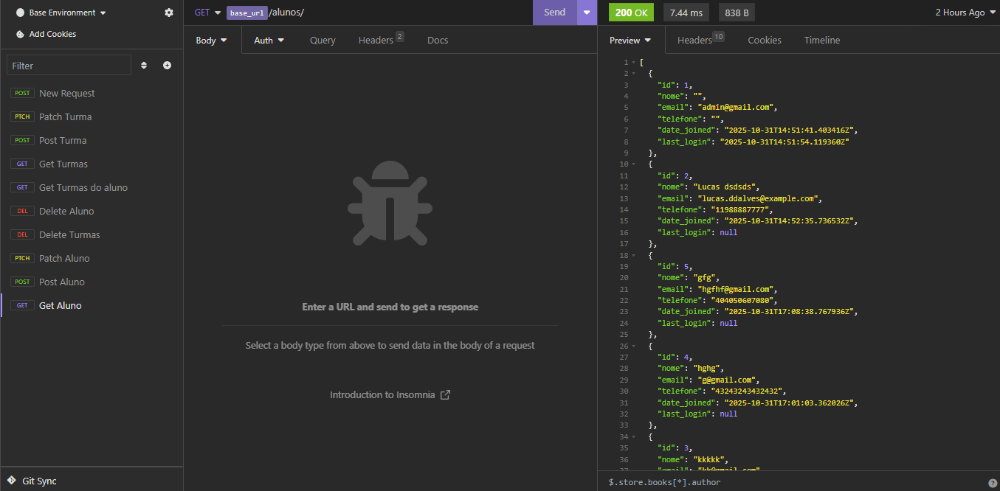

# StratacSec-DEV-Teste

## Requisitos de Ambiente

- **Python 3.11+**
- **Node.js 24.11.0**
- **Angular CLI 20.3.7**
- **Git**
- **SQLite3**

---

## Configuração do Backend (Django)

### Clonar o projeto

- git clone https://github.com/seu-repositorio/gestao_salas.git

- cd gestao_salas

### Aplicar migrações
- python manage.py makemigrations
- python manage.py migrate

### Criar Super Usuario
- python manage.py createsuperuser

### Rodar Servidor
- python manage.py runserver

O backend estará acessível em:
👉 http://127.0.0.1:8000/api/

---

## Configuração do Frontend (Angular)

### entrar na pasta frontend
- cd frontend

### instalar dependências
- npm install

### rodar o servidor
- ng serve

O frontend estará disponível em:
👉 http://localhost:4200/

## Teste de Backend

É possível realizar testes na api através em:
    http://127.0.0.1:8000/api/

Ou utilizar o insomi, esse é um exemplo de GET Alunos:

## Dificuldades

Durante o desenvolvimento, enfrentei dificuldades com a implementação da autenticação por token e a autorização de usuários no frontend. Por conta disso, a funcionalidade completa de controle de acesso ainda não foi totalmente implementada e isso influenciou as restrições do Aluno (por enquanto estão abertas como AllowAny). Acredito que uma possível solução é capturar o campo isAdmin e usar um Interceptor do token, porém, ainda não consegui. Após isso, será possível colocar em prática as permissões e implementar corretamente a matrícula para associar o aluno à turma (no backend isso já funciona) e os recursos.

A principal dificuldade está na parte de lógica do frontend, pois ainda não tenho muita experiência com Angular.
